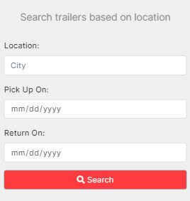
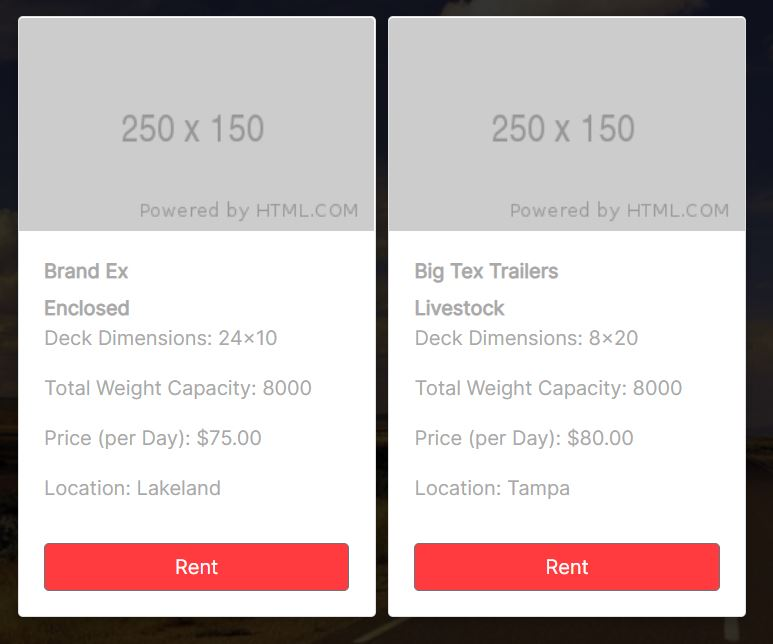
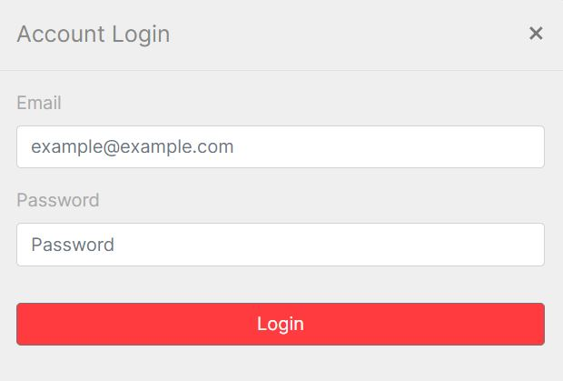
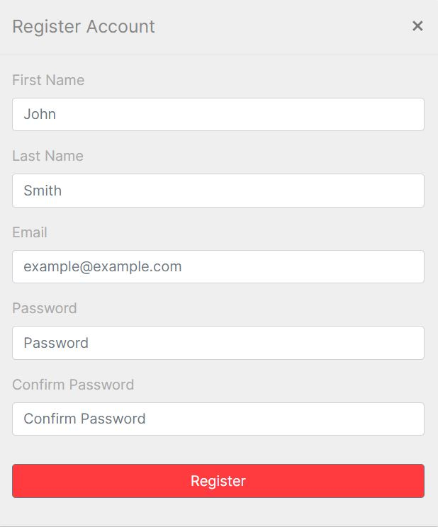
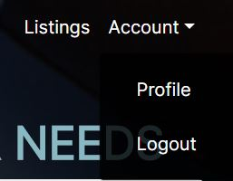
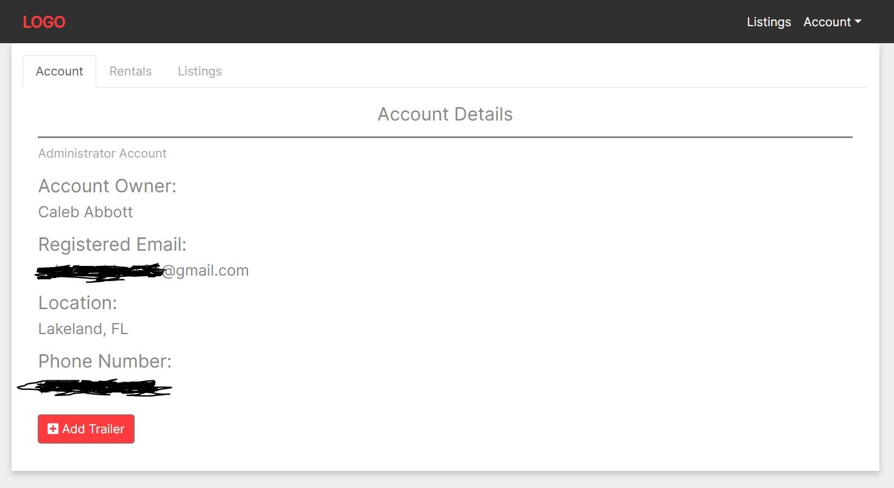
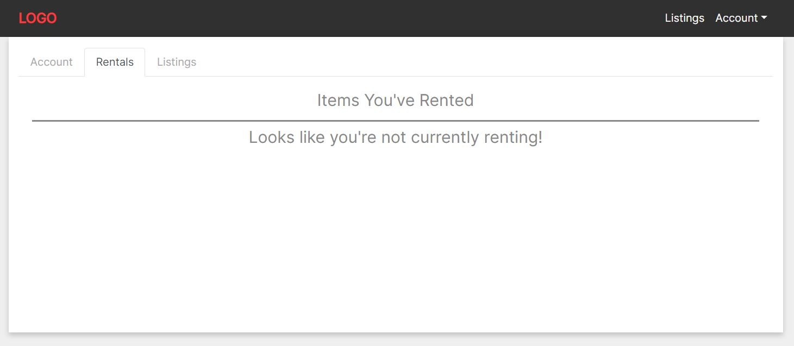
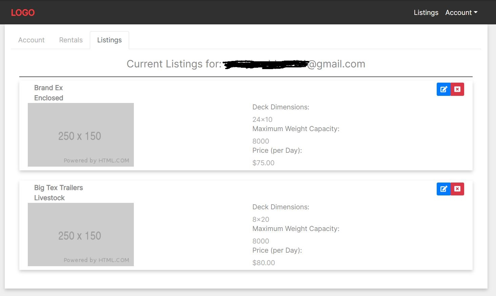
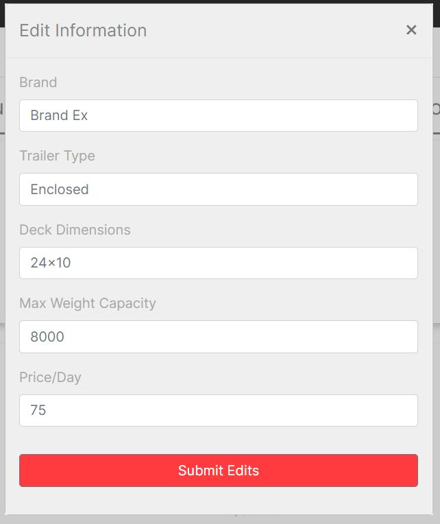

# LoadCo

Whether you're looking to rent, or list your personal trailer to earn some additional income, **LoadCo** is the right place for you.

Avoid the headache of going through a large company to rent something of theirs for an absurd price and connect with one of our many members who are listing their trailers at an affordable price, right next door!

On the landing page, you will have access to the Navigation bar, containing a couple links, and the Quick Search feature.

The Quick Search is exactly as it sounds. The user needs only to submit a location to be provided with a list of available trailers, based on seaerched location.

If the user wishes to have a more comprehensive list displayed, they should simply click on the **Listings** link; found on the Navbar.
They will be then taken to a page that looks like the below:

This site features user account, which can be logged into, or registered by accessing the corresponding Navbar links.

Once logged in, users can access their account details, by navigating to **Profile**, found under the **Account** dropdown menu.

The **Profile** section features three tabs:

Tab One: Basic account information and **Add Trailer Button**

Tab Two: Any items the user is currently renting.

Tab Three: Any items the user currently has listed for rent.

From this tab, users also have access to the **Edit Button**

After clicking the **Edit Button**, the Edit modal will be displayed with the placeholders being what is currently displayed.

# Future Development

- User Messages to organize pickup and dropoffs of trailers
- Credit card proccessing
- Hook up available dates to allow further filtering in Quick Search
- Finish logic for Rent button
